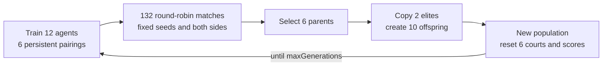

# Reinforcement Learning Pong — Project Handoff

Last verified: 2026-09-19

Branch: `genetic-algorithm`

Source revision: working tree based on `8b5f491`

## Current state

The project contains the original Phaser Pong modes plus a six-court evolutionary-training view. Evolution runs twelve independent DQN agents—two per isolated headless arena—while Phaser renders validated LIVE snapshots with interpolation. Python is authoritative for evolution physics; Classic 1v1 remains owned by `BasicGame.js`.

SPEC-01 through SPEC-07 are integrated:

- SQLite experiment, lineage, evaluation, match, and checkpoint persistence.
- Deterministic genetic architecture evolution for a population of twelve.
- Six simultaneous Phaser courts using the original game assets and proportions.
- Independent Dueling Double DQN agents, replay buffers, optimizers, and counters.
- Headless 60 Hz Pong physics aligned with Classic Pong constants and bounce rules.
- Generation-scoped training orchestration and Socket.IO LIVE streaming.
- Full round-robin, inference-only evaluation and normalized fitness.

SPEC-08 champion promotion and SPEC-10 optimization are not implemented.

## Verified lifecycle

- A point increments the correct score, emits a terminal RL transition, preserves paddle positions and accumulated scores, and resets only the ball using the arena RNG.
- Scheduler chunks do not recreate arenas. Each pairing and match ID persists for its full generation.
- Training opponents and sides rotate only at generation boundaries.
- Reproduction creates a new population and six fresh arenas.
- Evaluation uses 66 unique pairings in both orientations, disables exploration/training, and verifies weights, replay, and counters are unchanged.

## Delivery status

- `optimization-phaser` pushed at `ee9531b`.
- `genetic-algorithm` fast-forwarded and pushed at `ee9531b`.
- Merged-branch gate: 48 backend tests, 52 frontend tests, and Vite production build passed.
- The broader optimization-branch gate also passed 128 backend tests.

## Important paths

| Area | Source |
|---|---|
| Evolution orchestration | `Server/app/evolution/training_orchestrator.py` |
| Fitness and evaluation | `Server/app/evolution/evaluation.py` |
| Genetic algorithm | `Server/app/evolution/genetic.py`, `genome.py` |
| Evolution physics | `Server/app/evolution/simulation.py`, `Server/app/ai/pong_training_env.py` |
| DQN | `Server/app/ai/dqn_agent.py` |
| Persistence | `Server/app/persistence/` |
| Socket.IO | `Server/app/sockets.py` |
| Six-court scene | `PongGame/src/scenes/EvolutionTrainingScene.js` |
| Snapshot feed/playback | `PongGame/src/evolution/` |
| Shared court renderer | `PongGame/src/components/pongCourtView.js` |

See `Docs/technical-documentation/` for architecture and developer guidance.

## Operational notes

- Docker stores evolution data under `/app/evolution_data` in the `evolution_data` named volume.
- `EVOLUTION_ROUND_TICKS` is a scheduling/stop-check chunk, not a match lifetime.
- At 1×, physics advances at 60 simulation steps per second; 2×/4× increase simulation pacing without skipping physics steps.
- Snapshot batching uses a bounded latest-value queue, so rendering can drop stale batches without fabricating states.

## Known limitations

- Round-robin evaluation is CPU-bound and processes at most six matches concurrently.
- Replay buffers are not inherited or persisted between agents/generations.
- Offspring inherit only shape-compatible policy tensors from parent A; architecture genetics uses both parents.
- The production backend image omits pytest; local development requirements include it.
- The frontend production bundle remains approximately 1.56 MB minified.
- Champion promotion and automated performance optimization remain out of scope.
