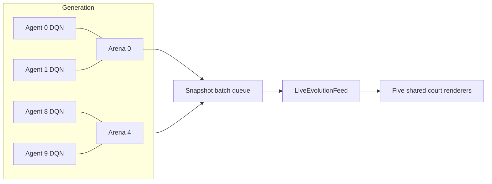
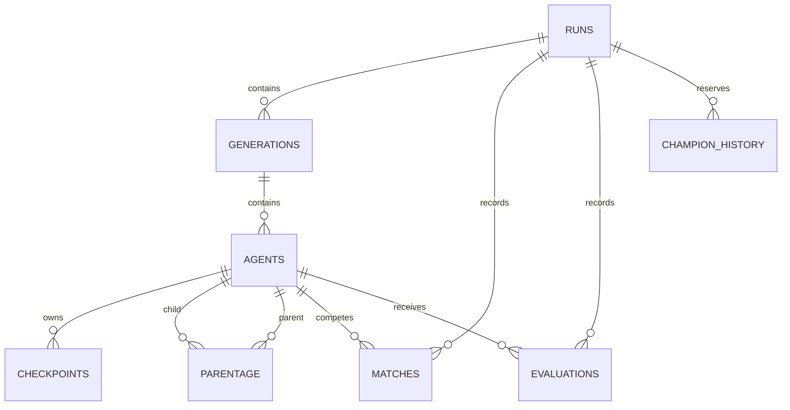

# Architecture

## Runtime boundaries

The Flask application factory creates the ordinary training service and, when `EVOLUTION_TRAINING_ENABLED=1`, the evolution service. `EvolutionTrainingService` owns the active run, population, generation-scoped simulation engine, evaluator, genetic algorithm, controller, and persistence store.

Each generation has ten `AgentRecord` objects and five `MatchSession` objects. Every DQN owns its policy network, target network, Adam optimizer, replay buffer, RNG, action counter, and optimization counter. Every match owns its `PongTrainingEnv`, RNG, scores, paddle/ball state, sequence, and point-return counters.

## Simulation and lifecycle

`PongTrainingEnv` advances fixed steps of $\Delta t=1/60$ second. The constants match the Classic court: 800×600 logical units, 500-unit/s paddles, the same object dimensions, normal-distributed serves, and the same collision/bounce parameters.

Collision order is paddle movement, ball integration, vertical-wall rebound, goal detection, then paddle collision when no goal occurred. A rally cap forces a point to prevent unbounded rallies.

Evolution uses `MatchConfig.continuousPlay=True`. On a point:

1. The physical scorer and identity scorer are resolved, including reversed sides.
2. The score increments once.
3. The transition is stored with `done=True`.
4. Previous state/action pointers are cleared to prevent cross-serve bootstrapping.
5. The ball is centered and served by the arena's seeded RNG.
6. Paddle positions, scores, agent identities, and match sequence continue.

`roundTicks` only divides work into scheduling chunks. The engine, actions, pairing, scores, RNG, and sequence persist across chunks. At the next generation, the old engine is discarded, pairings rotate via the circle method, and five new matches start at zero.

## Socket.IO and rendering

Client controls:

| Event | Purpose |
|---|---|
| `evolution_start_run` | Start a background evolution run with UUID, seed, formula, and playback speed. |
| `evolution_set_playback_speed` | Select 1×, 2×, or 4× pacing. |
| `evolution_pause_run` / `evolution_resume_run` | Control work at scheduler boundaries. |
| `evolution_stop_run` | Request a clean stop. |

Server output uses `evolution_event`. Five snapshots are grouped into `match_snapshot_batch`; a queue of size two drops the oldest stale batch under backpressure. Population, metrics, evaluation, completion, and error events are emitted directly.

`LiveEvolutionFeed` validates contracts, expands batches, and labels live data. `SnapshotPlayback` interpolates positions between real snapshots according to sequence distance, 60 Hz physics, and playback speed. A new `matchId` resets interpolation. `EvolutionTrainingScene` renders the five courts in the Classic game area using the shared Pong renderer and assets.

## Persistence

`EvolutionStore` uses SQLite migrations and a checkpoint directory. Main relationships:

The database records run configuration/provenance, generation status, agent architecture/role, lineage, one accumulated match per arena/generation, fitness components, and checkpoint hashes. SQL triggers and store guards keep agents, evidence, and parentage within the same run. Checkpoints use model-spec version 3, SHA-256 verification, and controlled recovery that marks corrupt/missing agents unavailable.

Champion-history storage exists for schema continuity, but SPEC-08 promotion behavior is not implemented.
