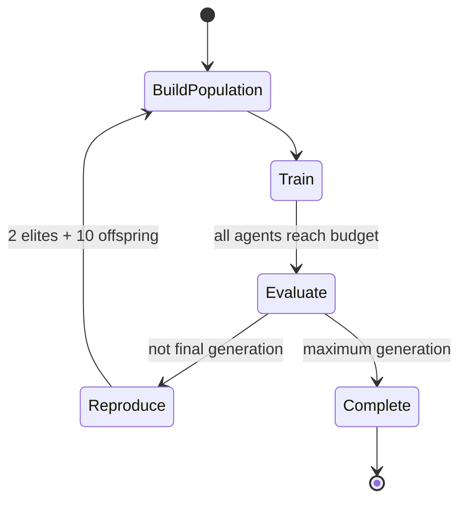

# DQN, Fitness, and Evolution

## Dueling Double DQN

Each agent converts Pong into a mirrored, player-centric 12-value vector: normalized ball position/velocity, both paddle positions, two paddle-to-ball offsets, clipped score differential, velocity signs, and terminal flag. Actions are `UP`, `DOWN`, and `STAY`.

Architectures contain one to four hidden ReLU layers with widths from $\{32,64,128,256\}$. The dueling head computes

$$Q(s,a)=V(s)+A(s,a)-\frac{1}{|\mathcal A|}\sum_{a'}A(s,a').$$

Training samples uniform replay, uses Huber loss and Adam, clips gradient norm, and applies Double DQN targets:

$$y=r+\gamma(1-d)Q_{\theta^-}\!\left(s',\arg\max_{a'}Q_\theta(s',a')\right).$$

For point transitions $d=1$, so the target is exactly the immediate reward. The next serve cannot bootstrap into the completed rally. Optimizer frequency is configurable; telemetry reports `optimizerUpdates / replayTransitions` as the update-to-data ratio.

## Fitness and evaluation

All components and final fitness are bounded to $[0,1]$:

$$W=\frac{wins+0.5\,draws}{matches}$$

$$P=0.5+0.5\frac{pointsFor-pointsAgainst}{\max(1,pointsFor+pointsAgainst)}$$

$$C=\frac{\min(\text{combos},\;matches\cdot comboCap)}{matches\cdot comboCap}$$

$$F=0.65W+0.25P+0.10C.$$

With zero matches, all components and fitness are zero. The evaluator plays every unique population pairing in both paddle orientations: 66 pairings and 132 matches for twelve agents. Seeds are assigned reproducibly across tournament rounds, matches stop at seven points or 2,000 steps, and at most six run in lockstep. It disables training and exploration and asserts weights, replay size, action steps, and optimization steps remain unchanged. Aggregate fitness and every match are persisted.

## Genetic evolution

Default population parameters are twelve agents, six selected parents, two elites, ten offspring, and mutation probability 0.20. Ranking is deterministic for a recorded generation seed, including randomized tie breaks.

Architecture crossover splices the parent hidden-width sequences. Mutation can add a layer, remove a layer, or change a width while respecting architecture bounds.

Weight inheritance is deliberately conservative:

- Elites receive exact deep copies of both trained policy and target networks. Tensor equality is verified.
- Offspring architecture comes from both parents, but tensors are copied from parent A only when the key exists and shape matches.
- Missing or incompatible tensors retain the child's fresh initialization; they are never merged silently.
- The offspring target network is synchronized from its resulting policy network.
- Optimizer state, replay, and counters start fresh for every new-generation agent.

## Generation state machine

Within one generation, training pairings remain fixed and all six arenas persist. At the boundary, the separate round-robin evaluator completes before reproduction; the new population then resets all courts and scores.
