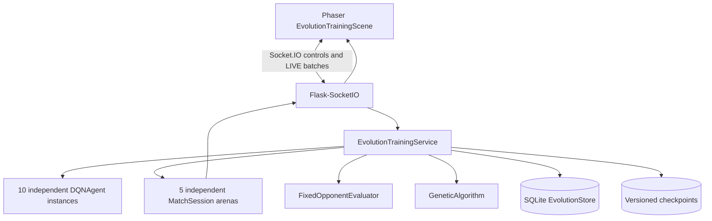

# Pong Evolution Technical Documentation

This documentation describes revision `ee9531b` on `genetic-algorithm`.

## Documents

- [Architecture](ARCHITECTURE.md): runtime components, simulation, Socket.IO, and persistence.
- [ML and evolution](ML_EVOLUTION.md): DQN, fitness, evaluation, inheritance, and generation lifecycle.
- [Developer guide](DEVELOPER_GUIDE.md): modification points, configuration, Docker, Makefile, tests, and limitations.

## System overview

The backend owns evolution simulation and learning. The frontend never fabricates training gameplay: it validates, buffers, and interpolates real snapshots. Classic 1v1 remains a separate Phaser-owned mode.
