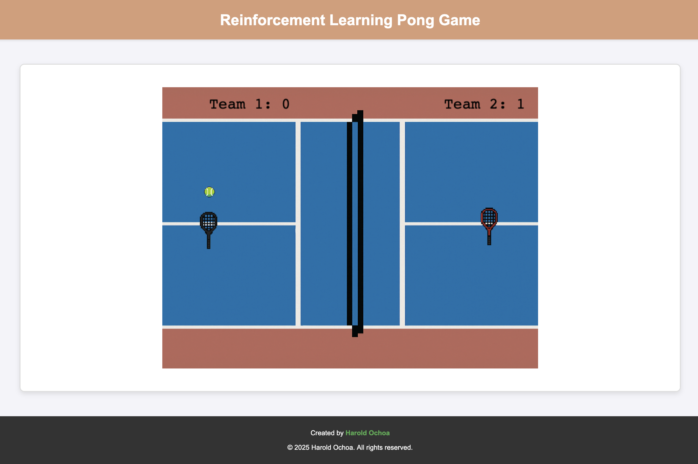

**[🔙 ](README.md)**

# 🏓 Pong Game – Reinforcement Learning Edition

This is a simple Pong-style game built using **PhaserJS**, bundled with **Vite**, and powered by **NodeJS**. It serves as a fun playground for experimenting with reinforcement learning and basic game mechanics.



---

## 🧰 Tech Stack

- **NodeJS**
- **Vite** – for fast development builds
- **PhaserJS** – game development framework

---

## 🚀 Getting Started

### ✅ Requirements

Before running the project, make sure you have the following installed:

- [Node.js](https://nodejs.org/en/)

### 📦 Installation & Run

1. **Clone the repository**  
```bash
git clone https://github.com/Harold2828/ReinforcementLearningPong
```
2. **Navigate into the project folder**
```bash
cd PongGame
```
3. **Install the dependencies**
```bash
npm install
```
4. **Run the development server**
```bash
npm run dev
```

💡 Open your browser and navigate to the local server URL provided in the terminal (typically http://localhost:5173)
