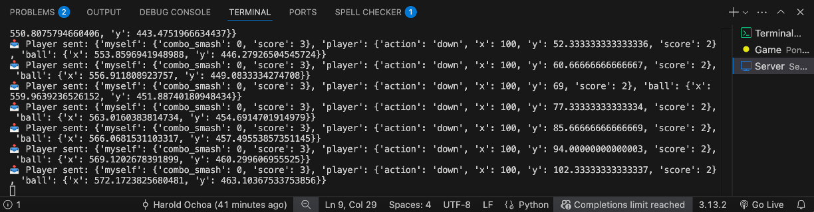

# Server Side

## Overview  
This module manages all communication logic and hosts a functional AI model that interacts with the game environment. It handles incoming data, processes reinforcement learning updates, and facilitates real-time decision-making.  

### Key Features  
- **Data Processing:** Structures and filters incoming information before passing it to the AI model.  
- **WebSockets Integration:** Enables seamless two-way communication between the game and the AI model.  
- **Model Updates:** Supports dynamic learning updates, allowing adaptive behavior improvements over time.  
- **Error Handling:** Implements logging and fault tolerance mechanisms to ensure stable interactions.  

  

## Technologies  
This system is built using Flask with WebSockets for real-time interaction between the AI model and the game engine.  

### Dependencies  
Ensure you have the following installed before running the server:  
- Python 3.x  
- Flask  
- Flask-SocketIO  
- PyTorch

## How to Run It  

1. **Activate the virtual environment:**  
```bash
source server_env/bin/activate
```
2. **Install dependencies:**
```bash
pip install -r requirements.txt
```
3. **Start the server:**
```bash
python run.py
```
4. **Verify Connection:** Open a WebSocket client or the game interface to confirm communication with the server.